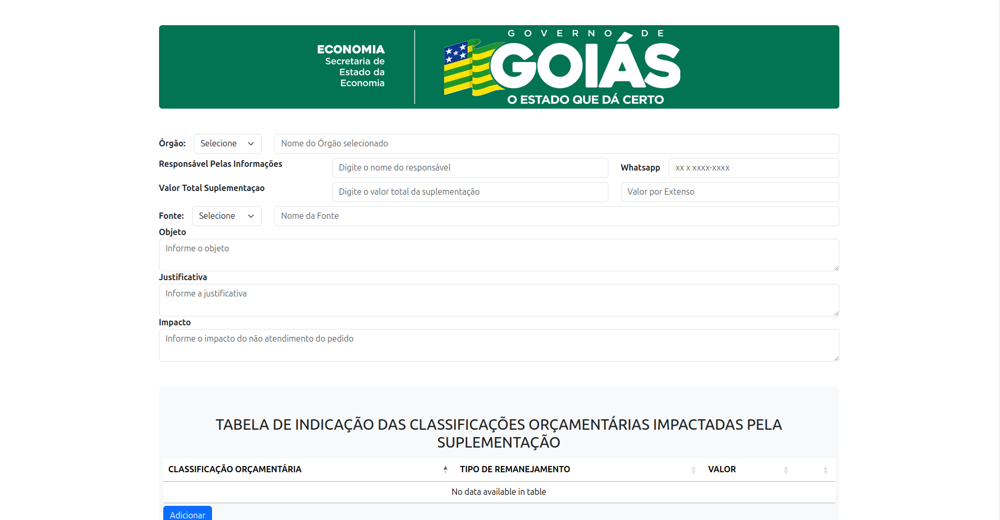
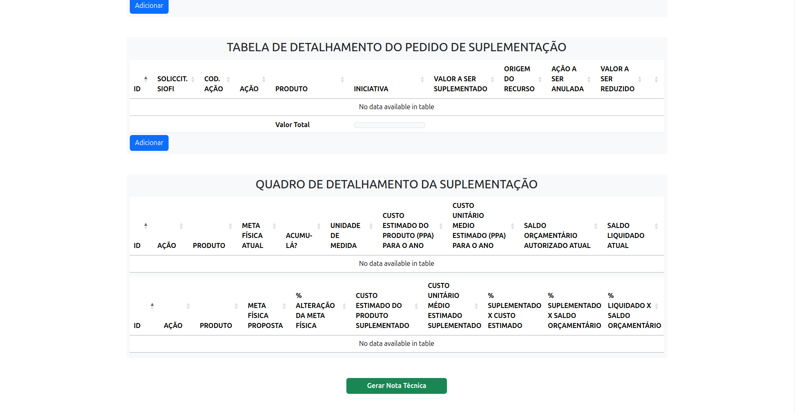

# Formulário Nota Técnica SCPMA  

Este projeto tem como objetivo desenvolver uma página web para automatizar e gerar relatórios, visando acelerar e aprimorar a recepção de respostas dos órgãos competentes. Com isso, espera-se melhorar o controle e reduzir o tempo necessário para realizar todas as tarefas manualmente.

## Tecnologias

## Índice

- [Sobre](#sobre)
- [Funcionalidades](#funcionalidades)
- [Tecnologias](#tecnologias)
- [Instalação](#instalação)
- [Uso](#uso)
- [Fotos](#fotos)
- [Contato](#contato)

## Sobre
Devido às janelas de crédito, onde todos os órgãos públicos podem solicitar suplementação ou anulação de recursos, esses processos foram, por muito tempo, realizados e analisados manualmente. Diante da oportunidade de aprendizado e da possibilidade de automatizar essas tarefas, propus a criação de uma página web para que os órgãos preencham os dados e gerem relatórios automaticamente.
Com isso poupariamos tempo dos órgãos com o preenchimento e digitação de documentos além de ter controle sobre os pedidos, além disso com os cálculos automatizados evitaria erros por parte dos mesmos.

## Funcionalidades

- Calculos automáticos.
- Preenchimento automatizado pelo código da ação.
- Geração de pdf formato no padrão exigido.

## Aplicação

- https://formeconomia.netlify.app/

## Fotos

## Contato

